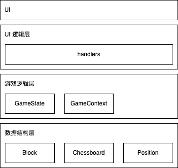
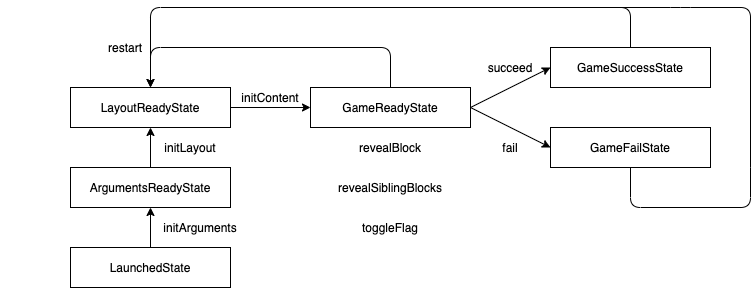

# Vite + Vue3 + MineSweeper

一个使用 Vite、Vue3 编写的**扫雷(Mine Sweeper)**游戏！还原童年经典！[点击这里可以开始游玩](https://hemaoqi-tom.github.io/vite-vue3-minesweeper/) 

## 1 特色

* 还原了 Windows 扫雷的经典难度配置（初级、中级和高级），以及新增地狱难度，其棋盘大小和高级完全相同，但是炸弹数 💣 为 199 个而非高级的 99 个
* 同时支持浅色主图和深色主题，可以一键切换
* 使用 Vue3 和 Vite，没有使用任何的第三方组件库，所有样式均为自己编写

## 2 使用

1. 在线试玩：[Vite-Vue3-MineSweeper 在线试玩](https://hemaoqi-tom.github.io/vite-vue3-minesweeper/) 
2. 本地运行

* 将项目 `clone` 到本地

```bash
git clone https://github.com/hemaoqi-Tom/vite-vue3-minesweeper.git
```

* 安装 `yarn` 和 `vite` 

```bash
npm install -g yarn vite
```

* 安装项目所需的依赖

```bash
cd vite-vue3-minesweeper && yarn
```

* 运行项目

只是在本机上运行，请使用

```bash
vite
```

如果想部署到局域网（同网段下的其他主机可以通过 ip 地址访问该项目），请使用

```bash
vite --host
```

## 3 编写项目的一些心得

我是自底向上进行项目架构的，从最基础的数据结构层，到运用数据结构的游戏逻辑层，再到 UI 的逻辑层，最后是 UI，整体呈现如下的四层结构：



* **数据结构层**：里面存放了一些游戏中使用到的最基本的数据结构
* **游戏逻辑层**：里面存放了游戏的相关逻辑
* **UI 逻辑层**：负责游戏逻辑和 UI 之间的沟通
* **UI**：负责和用户交互

### 2.1 数据结构层

数据结构层主要包含三个数据结构：`Block`、`Chessboard` 和 `Position`，位于 `./src/pages/MineSweeper/entities` 中

* **格子类**：用于抽象扫雷游戏中的方块格子
* **棋盘类**：用于抽象扫雷游戏中的棋盘，其包含若干方块格子
* **坐标类**：用于表示格子在棋盘中的坐标

其中，棋盘类使用**静态工厂函数**进行创建：`Chessboard.createChessboard`（位置：[Chessboard.entity.ts](https://github.com/hemaoqi-Tom/vite-vue3-minesweeper/blob/main/src/pages/MineSweeper/entities/Chessboard.entity.ts)），目的是确保传入的参数合法

> **工厂模式**是**创建型模式**，其最常见的形式是：通过静态方法创建对象并返回
>
> 常见的应用场景：
>
> * 可以根据入参，动态决定实现某个接口的子类
>
> ```typescript
> abstract class GeometryShape {}
> 
> class Circle extends GeometryShape {
>   shape = 'Circle';
>   constructor(public readonly radius: number) {}
> }
> 
> class Rectangle extends GeometryShape {
>   shape = 'Rectangle';
>   constructor(
>   	public readonly length: number,
>     public readonly width: number,
>   ) {}
> }
> 
> // 工厂函数
> function createGeometryShape(args: number[]): GeometryShape {
>   // 根据 args 的长度, 动态决定生成 Circle 还是 Rectangle
>   // 动态 === 运行时
>   if (args.length === 1) {
>     return new Circle(...args);
>   } else if (args.length === 2) {
>     return new Rectangle(...args);
>   } else {
>     throw new Error('Arguments error ...');
>   }
> }
> ```
>
> * 可以检查入参是否满足要求
>
> ```typescript
> class Circle {
>   shape = 'Circle';
>   constructor(public readonly radius: number) {}
> }
> 
> function createCircle(radius: number): Circle {
>   if (radius <= 0) {
>     throw new Error('Arguments error ...');
>   }
> }
> ```

`Chessboard` 的构造方法修饰为 `private`，只能使用工厂函数进行调用，在工厂函数中对参数进行检查，确保参数的正确性

### 2.2 游戏逻辑层

游戏逻辑层整体使用**状态模式**进行构建，位于 `./src/pages/MineSweeper/states` 中

> **状态模式**是**行为设计模式**，是**有限状态机**在设计模式上的一个具体体现
>
> * 优势：避免大量使用 Boolean 变量
> * 劣势：每添加一个状态，需要对所有的状态的代码进行修改，代码耦合度较高
>
> 状态模式主要有两个类：`State` 抽象类（也可以是接口）和 `Context` 类
>
> * **`State` 抽象类**中定义了状态之间方法的集合，均为抽象方法，其由继承自 `State` 抽象类的某个子类进行实现，这样设计的好处是，对于一个 `State` 类型的子类对象，我们可以任意调用其上的方法，但其行为由其具体子类实现定义
> * **`Context` 类**保存了当前具体的 `State`，代理外部代码对当前状态中的具体方法的调用，以及定义了状态之间共享的数据
> * `State` 抽象类保存了对配套 `Context` 类的引用，`Context` 类也保存了当前具体的 `State` 

`GameState` 类是状态模式中的 `State` 类，`GameContext` 是状态模式中的 `Context` 类，`game-states` 文件夹中的所有类为继承自 `GameState` 的、具体的状态类，共有六个：

* `LaunchedState`：游戏加载完毕便会进入该状态
* `ArgumentsReadyState`：用户输入扫雷棋盘的参数（行数、列数、炸弹数）后，便会进入该状态
* `LayoutReadyState`：扫雷棋盘渲染完毕后，用户第一次点击前的状态，此时棋盘中的内容尚未生成
* `GameReadyState`：用户第一次点击后的状态，棋盘中的内容已经生成
* `GameSuccessState`：游戏胜利
* `GameFailState`：游戏失败

整体的状态转换示意图如下：



### 2.3 UI 逻辑层

UI 逻辑层主要位于 `./src/pages/MineSweeper/hooks` 中，负责游戏逻辑和 UI 逻辑之间的通信，主要包含 `useGameContext.ts` 和 `useTheme.ts` 

* `useGameContext.ts` 主要负责游戏逻辑和 UI 之间的通信
* `useTheme.ts` 主要负责游戏的主题切换（浅色主题、深色主题）


